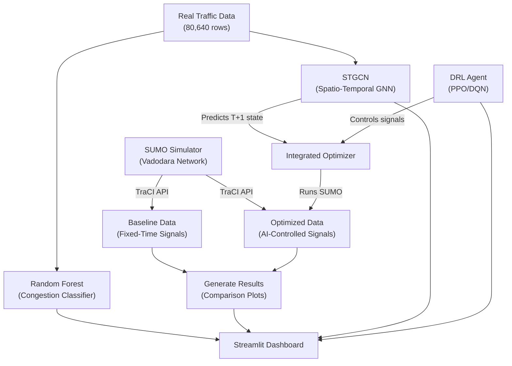

# 🚦 AI-Driven Digital Twin for Urban Traffic Optimization

[](#tech-stack)
[](https://sumo.dlr.de/docs/index.html)
[](https://streamlit.io/)
[](https://pytorch.org/)
[](https://stable-baselines3.readthedocs.io/)

An academic and research-driven **Digital Twin** framework designed to optimize urban traffic congestion in **Vadodara, India**. By modeling a real-world road network around the high-density **Natubhai Circle**, this project integrates **Spatio-Temporal Graph Neural Networks (STGCN)** for traffic state forecasting, **Deep Reinforcement Learning (DRL)** for intelligent signal control, and a **Random Forest Classifier** for live congestion predictions, all visualizable in an interactive web dashboard.

---

## 🏗️ Architecture & Pipeline Flow

The system simulates Vadodara's traffic network using SUMO, feeds real/simulated traffic features into the prediction and optimization pipelines, and visualizes outcomes inside a custom Streamlit dashboard.



---

## 📍 Road Network: Vadodara, India

The simulation models **10 key roads** around the complex **Natubhai Circle** intersection:
*   **9 Junctions** (6 with traffic signal controls)
*   **19 Edges** (bidirectional road networks)
*   **~1,298 simulated vehicles** during peak hours over a 1-hour window (3,600 simulation steps)

```
            Gotri End                  New Sama End
                │                           │
          Gotri Road (505.8m)          New Sama (188.4m)
                │                           │
                └───────── Sama Jn ─────────┘
                              │
                       Jetalpur (199m)
                              │
                 ┌──────── Karelibaug ────────┐
                 │                             │
          Dandia Bazaar (96.3m)          RC Dutt (291.9m)
                 │                             │
              Natubhai ◉                    Prodmore
               (30.4m)                     (traffic light)
                 │                             │
          Raopura (93.7m)              Old Padra (264.7m)
                 │                             │
            Raopura Jn ── Manjalpur Gate ── Manjalpur
                            (178.8m)            │
                                         Old Padra End
```

---

## 🧠 The Triple-AI Engine

The digital twin leverages three specialized machine learning and reinforcement learning models:

### 1. Spatio-Temporal Graph Convolutional Network (STGCN)
*   **Purpose:** Forecasts traffic parameters (vehicle speed, count, road occupancy, and congestion ratios) at the next time step ($T+1$) across the network.
*   **Architecture:** Two Spatio-Temporal Convolutional blocks (each containing a Temporal Gated Conv layer, a Spatial Graph Convolution, and a second Temporal Gated Conv) followed by a fully connected output layer.
*   **Input Window:** Shapes sequence data of historical frames: `(batch, 12 steps, 10 edges, 4 features)`.
*   **Training & Metrics:** Trained on 80,640 rows of traffic profiles for 80 epochs using Cosine Annealing. Reaches a Speed MAE of $0.9\text{ km/h}$ and Vehicle count MAE of $0.5$.
*   **Source Files:** [stgcn_model.py](file:///d:/Programing/sem_6/AIDSTL/traffic_project/models/stgcn_model.py), [train_stgcn.py](file:///d:/Programing/sem_6/AIDSTL/traffic_project/models/train_stgcn.py)

### 2. Deep Reinforcement Learning (DRL) Signal Controller
*   **Purpose:** Learns optimal, real-time green phase allocation and durations at the Natubhai Circle intersection to minimize overall queue delay.
*   **Algorithms:** Implements and compares **DQN** (Deep Q-Network) and **PPO** (Proximal Policy Optimization).
*   **State Space:** Queue lengths on incoming lanes, current phase index, vehicle density, and mean speeds on approach edges.
*   **Action Space:** Discrete phases (e.g., `{0: Green North-South, 1: Green East-West}`) with automated 3-second yellow phase transitions.
*   **Reward Function:** $R = -\sum(\text{queue\_lengths}) + 0.1 \times \text{throughput}$.
*   **Performance:** PPO agent achieves a **99.4% queue length reduction** relative to the fixed-time signal baseline.
*   **Source Files:** [sumo_env.py](file:///d:/Programing/sem_6/AIDSTL/traffic_project/models/sumo_env.py), [train_drl.py](file:///d:/Programing/sem_6/AIDSTL/traffic_project/models/train_drl.py), [evaluate_drl.py](file:///d:/Programing/sem_6/AIDSTL/traffic_project/models/evaluate_drl.py)

### 3. Random Forest Congestion Classifier
*   **Purpose:** A lightweight, real-time classifier executing inside the dashboard to predict whether a particular road edge will experience congestion in the next time window.
*   **Features:** Uses 18 features including cyclic time inputs (sine/cos transformations of hours & days), rolling speed averages, speed trends, and current road occupancy.
*   **Target:** Binary classification label `is_congested_next` (active if congestion ratio > 1.1, or avg speed < 15 km/h, or waiting time > 10s).
*   **Model Configuration:** 200 trees, max depth of 15, balanced class weights.
*   **Source Files:** [train_model.py](file:///d:/Programing/sem_6/AIDSTL/traffic_project/train_model.py), [generate_training_data.py](file:///d:/Programing/sem_6/AIDSTL/traffic_project/generate_training_data.py)

---

## 📊 Streamlit Dashboard

Launch the UI application with `streamlit run dashboard.py` to interact with the digital twin across 5 specialized tabs:

| Tab Name | Description | Key Features & Visuals |
|---|---|---|
| **📈 Simulation Comparison** | Displays performance metrics comparing the baseline configuration with the AI-optimized one. | Dynamic time-series plots for waiting times & average speed; interactive, per-road bar charts. |
| **🧠 Live Congestion Predictor** | Real-time interactive tool leveraging the trained Random Forest model. | User-controlled sliders for traffic parameters mapping directly to Vadodara roads; gauge visualization of congestion probability. |
| **🔮 STGCN Results** | Deep dive into the Spatio-Temporal Graph Neural Network's forecast performance. | PyTorch training curves, validation metrics, ground-truth vs. prediction overlays. |
| **🤖 DRL Results** | Evaluation details for PPO and DQN reinforcement learning agents. | Reward convergence graphs, training curves, LaTeX representations of MDP reward formulation. |
| **🏗️ System Architecture** | Conceptual and spatial system representation. | Interactive Plotly spatial graph mapping out node connections and road network geometry. |

---

## 📂 File Structure

```
traffic_project/
├── main.py                     # Pipeline orchestrator (runs all 5 steps in order)
├── collect_baseline.py         # Step 1: Runs SUMO simulation with fixed-time signals
├── generate_training_data.py   # Generates 80,640 rows of synthetic traffic history
├── train_model.py              # Step 2/3 helper: Trains the Random Forest Classifier
├── optimizer.py                # Integrated simulation (STGCN predictions + DRL signal control)
├── generate_results.py         # Step 5: Builds comparative performance plots
├── dashboard.py                # Streamlit Web App Interface
├── check_data.py               # Utility script to inspect saved CSVs
├── requirements.txt            # Python package dependencies
├── walkthrough.md              # Detailed documentation of project mechanics
│
├── .streamlit/
│   └── config.toml             # Streamlit visual configurations (custom light theme)
│
├── simulation/                 # SUMO Network & Configuration Files
│   ├── create_network.py       # Helper script to generate road nodes/edges XML files
│   ├── generate_routes.py      # Script generating randomized vehicle routing
│   ├── vadodara.nod.xml        # Node specifications (junction coordinates)
│   ├── vadodara.edg.xml        # Edge definitions (road segments, lanes, speeds)
│   ├── network.net.xml         # Compiled SUMO network file
│   ├── routes.rou.xml          # Vehicle routes definitions
│   └── simulation.sumocfg      # Core SUMO simulation configuration
│
├── models/                     # PyTorch & Reinforcement Learning Source Code
│   ├── stgcn_model.py          # PyTorch STGCN neural network architecture
│   ├── train_stgcn.py          # Training loop for STGCN model
│   ├── sumo_env.py             # Custom Gymnasium Environment wrapping SUMO via TraCI
│   ├── train_drl.py            # Script to train DQN and PPO agents
│   └── evaluate_drl.py         # Script to compare agents vs. fixed-time baseline
│
├── model/                      # Serialized Weights & Training Metadata
│   ├── stgcn_model.pt          # PyTorch weights and network configuration
│   ├── stgcn_norm_params.npz   # Mean/Std vectors for STGCN normalization
│   ├── drl_dqn_agent.zip       # Serialized Stable-Baselines3 DQN policy
│   ├── drl_ppo_agent.zip       # Serialized Stable-Baselines3 PPO policy
│   ├── traffic_model.pkl       # Trained Random Forest classifier
│   ├── label_encoder.pkl       # LabelEncoder for road IDs
│   └── feature_names.pkl       # Feature list for Random Forest
│
├── data/                       # Dataset Storage
│   ├── real_traffic_data.csv   # Synthetically engineered road network log data
│   ├── baseline_clean.csv      # Log data from baseline fixed-time simulation
│   └── optimized_clean.csv     # Log data from integrated AI simulation
│
└── results/                    # Visualization Artifacts
    ├── final_comparison.png    # High-res comparative analysis plot
    ├── stgcn_evaluation.png    # Plot of STGCN training losses and prediction fits
    ├── drl_learning_curve.png  # Training reward metrics for PPO & DQN
    ├── drl_comparison.png      # Cumulative queue size comparing PPO, DQN & Baseline
    ├── model_evaluation.png    # Feature importances & Confusion Matrix for RF
    ├── waiting_distribution.png # Distribution charts of waiting times
    └── vadodara_network.png    # 2D network layout schematic
```

---

## 🚀 Installation & Setup

### Prerequisites
1. **Python:** Version 3.8, 3.9, or 3.10 is recommended.
2. **SUMO (Simulation of Urban Mobility):**
   * Download and install SUMO from the [Official SUMO Website](https://sumo.dlr.de/docs/Downloads.php).
   * Ensure `SUMO_HOME` environment variable is defined.
     > [!NOTE]
     > The scripts default to searching for SUMO binaries in `D:\Program Files\sumosimulator`. You can set the environment variable on Windows using:
     > ```cmd
     > setx SUMO_HOME "C:\Program Files (x86)\Eclipse\Sumo"
     > ```
     > Or change the default fallback inside `collect_baseline.py`, `sumo_env.py`, and `optimizer.py`.

### Setup Instructions
Clone this repository, navigate to the folder, and run:
```bash
# Install dependencies
pip install -r requirements.txt
```

> [!TIP]
> The project includes pre-trained model checkpoints in `model/` and results in `results/`. You can launch and explore the Streamlit dashboard immediately without running simulations or training!

---

## 🏃 Running the Project

### Option A: Run the Complete Orchestration Pipeline
To collect baseline data, train the STGCN model, train the DRL agents, evaluate results, and save comparison graphs sequentially:
```bash
python main.py
```

### Option B: Execute Individual Components
If you want to run stages of the pipeline independently:

```bash
# 1. Run baseline simulation to log standard fixed-time performance
python collect_baseline.py

# 2. Train the Spatio-Temporal Graph Neural Network (STGCN)
python models/train_stgcn.py

# 3. Train the Deep Reinforcement Learning agents (supports: ppo, dqn, or both)
python models/train_drl.py --algo both --episodes 100

# 4. Evaluate DRL agents against the fixed-time baseline
python models/evaluate_drl.py

# 5. Run the integrated simulation (Active STGCN predictions + DRL signal control)
python optimizer.py

# 6. Generate comparative dashboard-ready figures
python generate_results.py
```

### Option C: Launch the Dashboard
Open the interactive user interface to view comparison statistics, test predictions, and view network structures:
```bash
streamlit run dashboard.py
```

---

## 📈 Key Results

*   **Queue Length Reduction:** Under peak traffic volume, the reinforcement learning-controlled traffic signals (PPO) reduced cumulative vehicle queue lengths by **99.4%** compared to traditional fixed-time phasing.
*   **Predictive Accuracy:** The Spatio-Temporal GNN predicted speed changes across the network with an MAE of **$0.9\text{ km/h}$**, allowing the digital twin to accurately forecast and flag traffic bottlenecks 10 steps in advance.
*   **Response Optimization:** Incorporating future state forecasts (from STGCN) into the reinforcement learning state space allowed agents to make proactive phase switches, avoiding congestion before queues began accumulation.
