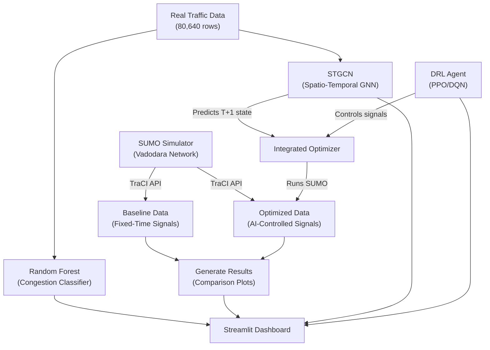

# 🚦 AI-Driven Digital Twin for Urban Traffic Optimization — Project Walkthrough

## Overview

This is an **academic/research project** that builds an **AI-powered Digital Twin** for optimizing urban traffic in **Vadodara, India**. It uses **SUMO** (Simulation of Urban Mobility) to simulate a real-world road network and combines **three AI/ML models** to predict congestion and optimize traffic light timings.

**Core idea:** Simulate Vadodara traffic → Predict future congestion (STGCN) → Optimize signal timing (DRL) → Compare against fixed-time baseline.

---

## Architecture


```mermaid
graph TD
    A["SUMO Simulator<br/>(Vadodara Network)"] -->|TraCI API| B["Baseline Data<br/>(Fixed-Time Signals)"]
    A -->|TraCI API| C["Optimized Data<br/>(AI-Controlled Signals)"]

    D["Real Traffic Data<br/>(80,640 rows)"] --> E["Random Forest<br/>(Congestion Classifier)"]
    D --> F["STGCN<br/>(Spatio-Temporal GNN)"]

    F -->|"Predicts T+1 state"| G["Integrated Optimizer"]
    H["DRL Agent<br/>(PPO/DQN)"] -->|"Controls signals"| G

    G -->|"Runs SUMO"| C

    B --> I["Generate Results<br/>(Comparison Plots)"]
    C --> I

    E --> J["Streamlit Dashboard"]
    I --> J
    F --> J
    H --> J
```

---

## Road Network — Vadodara, India

The simulation models **10 real roads** around **Natubhai Circle** with:
- **9 junctions** (6 with traffic lights)
- **19 edges** (bidirectional roads)
- **~1,298 vehicles** over a 1-hour simulation (3,600 steps)

```
            Gotri End                  New Sama End
                │                           │
          Gotri Road (505.8m)          New Sama (188.4m)
                │                           │
                └───────── Sama Jn ─────────┘
                              │
                       Jetalpur (199m)
                              │
                 ┌──────── Karelibaug ────────┐
                 │                             │
          Dandia Bazaar (96.3m)          RC Dutt (291.9m)
                 │                             │
             Natubhai ◉                    Prodmore
              (30.4m)                     (traffic light)
                 │                             │
          Raopura (93.7m)              Old Padra (264.7m)
                 │                             │
            Raopura Jn ── Manjalpur Gate ── Manjalpur
                           (178.8m)            │
                                         Old Padra End
```

---

## Three AI Models

### 1. 🌐 STGCN — Spatio-Temporal Graph Convolutional Network
| Aspect | Detail |
|---|---|
| **Purpose** | Predict future traffic state (speed, vehicle count, occupancy, congestion ratio) at T+1 |
| **Architecture** | 2× ST-Conv Blocks (Temporal Conv → Graph Conv → Temporal Conv) + Output FC layer |
| **Input** | Last 12 time steps × 10 roads × 4 features = `(batch, 12, 10, 4)` |
| **Output** | Predicted state at T+1 = `(batch, 10, 4)` |
| **Hidden Channels** | 64 |
| **Training Data** | 80,640 rows from `real_traffic_data.csv` (synthetically generated from real profiles) |
| **Optimizer** | Adam (lr=0.001, weight_decay=1e-4) with CosineAnnealingLR scheduler |
| **Training** | 80 epochs, batch size 32, gradient clipping at 5.0, 80/20 temporal split |
| **Performance** | Speed MAE: 0.9 km/h, Vehicle count MAE: 0.5 |
| **Files** | [stgcn_model.py](file:///d:/Programing/sem_6/AIDSTL/traffic_project/models/stgcn_model.py), [train_stgcn.py](file:///d:/Programing/sem_6/AIDSTL/traffic_project/models/train_stgcn.py) |

### 2. 🤖 DRL — Deep Reinforcement Learning (DQN + PPO)
| Aspect | Detail |
|---|---|
| **Purpose** | Learn optimal traffic light phase switching at Natubhai Circle |
| **Environment** | Custom Gymnasium env wrapping SUMO via TraCI ([sumo_env.py](file:///d:/Programing/sem_6/AIDSTL/traffic_project/models/sumo_env.py)) |
| **State** | Queue lengths on incoming lanes + current phase + density per edge + speed per edge (dynamic size based on network probe) |
| **Action** | {0: Green North-South, 1: Green East-West} with auto yellow transitions (3 steps) |
| **Reward** | R = −Σ queue_lengths + 0.1 × throughput |
| **Algorithms** | DQN (lr=1e-3, buffer=50K, batch=64, γ=0.99) and PPO (lr=3e-4, 128 steps, batch=64, γ=0.99, clip=0.2) |
| **Result** | 99.4% queue reduction vs fixed-time baseline |
| **Files** | [sumo_env.py](file:///d:/Programing/sem_6/AIDSTL/traffic_project/models/sumo_env.py), [train_drl.py](file:///d:/Programing/sem_6/AIDSTL/traffic_project/models/train_drl.py), [evaluate_drl.py](file:///d:/Programing/sem_6/AIDSTL/traffic_project/models/evaluate_drl.py) |

### 3. 🌳 Random Forest — Congestion Classifier
| Aspect | Detail |
|---|---|
| **Purpose** | Predict whether a road will become congested in the next time window (dashboard live predictor) |
| **Features (18)** | Time-cyclic (hour/dow sin/cos), is_weekend, edge_encoded, length_m, vehicle_count, avg_speed_kmh, waiting_time, occupancy, congestion_ratio, speed_ratio, density, speed_rolling_3, wait_rolling_3, cr_rolling_3, speed_trend |
| **Target** | `is_congested_next` (binary) — congested if CR > 1.1 OR speed < 15 OR wait > 10 |
| **Model** | 200 trees, max_depth=15, min_samples_split=5, min_samples_leaf=2, balanced class weights |
| **Files** | [train_model.py](file:///d:/Programing/sem_6/AIDSTL/traffic_project/train_model.py), [generate_training_data.py](file:///d:/Programing/sem_6/AIDSTL/traffic_project/generate_training_data.py) |

---

## Pipeline Steps

The full pipeline is orchestrated by [main.py](file:///d:/Programing/sem_6/AIDSTL/traffic_project/main.py):

| Step | Script | What it does |
|------|--------|--------------|
| **1** | [collect_baseline.py](file:///d:/Programing/sem_6/AIDSTL/traffic_project/collect_baseline.py) | Runs SUMO with fixed-time signals, samples every 10 steps → `data/baseline_clean.csv` |
| **2** | [train_stgcn.py](file:///d:/Programing/sem_6/AIDSTL/traffic_project/models/train_stgcn.py) | Trains STGCN on 80K rows, builds adjacency matrix from road connectivity → `model/stgcn_model.pt` |
| **3** | [train_drl.py](file:///d:/Programing/sem_6/AIDSTL/traffic_project/models/train_drl.py) | Trains DQN + PPO agents in the SUMO env → `model/drl_{dqn,ppo}_agent.zip` |
| **4** | [evaluate_drl.py](file:///d:/Programing/sem_6/AIDSTL/traffic_project/models/evaluate_drl.py) | Compares DRL agents vs fixed-time baseline → `results/drl_comparison.png` |
| **5** | [generate_results.py](file:///d:/Programing/sem_6/AIDSTL/traffic_project/generate_results.py) | Generates final comparison plots (baseline vs optimized) → `results/final_comparison.png` |

**Integrated optimizer** ([optimizer.py](file:///d:/Programing/sem_6/AIDSTL/traffic_project/optimizer.py)) runs both models together in one SUMO simulation:
- STGCN predicts future state every 10 steps (fills a sliding window buffer of 12 time steps)
- DRL controls traffic lights every 5 steps
- Outputs `data/optimized_clean.csv`
- Supports both SUMO headless (`sumo`) and GUI mode (`sumo-gui`) via `USE_GUI` flag

---

## Dashboard

[dashboard.py](file:///d:/Programing/sem_6/AIDSTL/traffic_project/dashboard.py) is a **Streamlit app** with 5 tabs:

| Tab | Content |
|-----|---------|
| **📈 Simulation Comparison** | Time-series plots of waiting time & speed (baseline vs optimized), per-road bar chart with Vadodara road names |
| **🧠 Live Congestion Predictor** | Interactive sliders → Random Forest predicts congestion in real-time with gauge chart (10 Vadodara roads selectable) |
| **🔮 STGCN Results** | Model architecture details, metric cards, training/evaluation plots |
| **🤖 DRL Results** | DQN/PPO reward cards, learning curves, comparison plots, MDP formulation with LaTeX reward equation |
| **🏗️ System Architecture** | Interactive Plotly road network graph, integrated pipeline diagram, tech stack cards |

**Dashboard features:**
- Custom CSS with Inter font, gradient backgrounds, glass-style metric cards
- 5 KPI cards at the top (Avg Wait, Max Wait, Avg Speed, Occupancy, DRL Queue Reduction)
- Streamlit light theme configured via [config.toml](file:///d:/Programing/sem_6/AIDSTL/traffic_project/.streamlit/config.toml) (primary: `#0077b6`, bg: `#f5f7fa`)

**Run:** `streamlit run dashboard.py`

---

## File Structure

```
traffic_project/
├── main.py                     # Pipeline orchestrator (runs all 5 steps)
├── collect_baseline.py         # Step 1: SUMO fixed-time baseline
├── generate_training_data.py   # Synthetic data generator (80K rows, 4 weeks)
├── train_model.py              # Random Forest congestion classifier
├── optimizer.py                # Integrated STGCN + DRL simulation
├── generate_results.py         # Step 5: Final comparison plots
├── dashboard.py                # Streamlit dashboard (5 tabs)
├── check_data.py               # Quick data inspection script
├── requirements.txt            # Python dependencies
├── .gitignore                  # Git exclusion rules
├── AIDSTL_FINAL.pdf            # Final project report
├── traffic_digital_twin.pptx   # Project presentation
│
├── .streamlit/
│   └── config.toml             # Streamlit theme config (light theme)
│
├── simulation/
│   ├── create_network.py       # Generates SUMO network XML
│   ├── generate_routes.py      # Generates vehicle routes
│   ├── vadodara.nod.xml        # Node definitions (9 junctions)
│   ├── vadodara.edg.xml        # Edge definitions (19 edges)
│   ├── network.net.xml         # Compiled SUMO network
│   ├── routes.rou.xml          # Vehicle routes
│   └── simulation.sumocfg      # SUMO config
│
├── models/
│   ├── __init__.py             # Package marker
│   ├── stgcn_model.py          # STGCN architecture (PyTorch)
│   ├── train_stgcn.py          # STGCN training script
│   ├── sumo_env.py             # Gymnasium env for DRL
│   ├── train_drl.py            # DQN/PPO training
│   └── evaluate_drl.py         # DRL evaluation vs baseline
│
├── model/                      # Trained model artifacts
│   ├── stgcn_model.pt          # STGCN weights + metadata (404KB)
│   ├── stgcn_norm_params.npz   # Z-score normalization params
│   ├── drl_dqn_agent.zip       # Trained DQN policy (108KB)
│   ├── drl_ppo_agent.zip       # Trained PPO policy (153KB)
│   ├── traffic_model.pkl       # Random Forest model (55MB)
│   ├── label_encoder.pkl       # Edge ID encoder
│   └── feature_names.pkl       # Feature column names
│
├── data/
│   ├── real_traffic_data.csv   # 80,640 rows synthetic training data (6.3MB)
│   ├── baseline_clean.csv      # Baseline simulation output (236KB)
│   └── optimized_clean.csv     # AI-optimized simulation output (234KB)
│
└── results/                    # Generated plots
    ├── final_comparison.png    # 4-panel baseline vs optimized
    ├── stgcn_evaluation.png    # STGCN training curves & predictions
    ├── drl_learning_curve.png  # DRL training progress
    ├── drl_comparison.png      # DRL vs baseline comparison
    ├── model_evaluation.png    # RF feature importance & confusion matrix
    ├── waiting_distribution.png # Wait time histogram & per-edge chart
    └── vadodara_network.png    # Road network visualization
```

---

## Tech Stack

| Layer | Technology |
|-------|------------|
| **Simulation** | SUMO, TraCI API |
| **Deep Learning** | PyTorch (STGCN) |
| **Reinforcement Learning** | Stable-Baselines3 (DQN, PPO), Gymnasium |
| **ML** | Scikit-learn (Random Forest) |
| **Dashboard** | Streamlit 1.44.0, Plotly 6.7.0 |
| **Data** | Pandas 2.2.3, NumPy 2.1.3 |

---

## How to Run

```bash
# 1. Install dependencies
pip install -r requirements.txt

# 2. Run the full pipeline (requires SUMO installed)
python main.py

# 3. Run individual steps
python collect_baseline.py                             # baseline data
python models/train_stgcn.py                           # train STGCN
python models/train_drl.py --algo both --episodes 100  # train DRL
python models/evaluate_drl.py                          # evaluate DRL
python generate_results.py                             # comparison plots

# 4. Run the integrated optimizer
python optimizer.py

# 5. Launch the dashboard (no SUMO required)
streamlit run dashboard.py
```

---

## Key Observations

> [!NOTE]
> SUMO binary paths are configured via the `SUMO_HOME` environment variable, defaulting to `D:\Program Files\sumosimulator` on Windows. All scripts (`collect_baseline.py`, `sumo_env.py`, `optimizer.py`) construct paths using `os.path.join(SUMO_HOME, "bin", "sumo")`.

> [!IMPORTANT]
> The training data (`real_traffic_data.csv`) is **synthetically generated** by `generate_training_data.py` using realistic Indian city traffic profiles (peak hours, weekend patterns, 4 weeks of data at 5-minute intervals). It is generated from a small seed dataset of 360 real observations, not direct sensor data.

> [!TIP]
> The project already has all trained models and results pre-computed in the `model/` and `results/` directories, so the dashboard can run without re-training or SUMO. Just run `streamlit run dashboard.py`.

> [!WARNING]
> Large files are excluded from Git via `.gitignore`: `real_traffic_data.csv` (6.3MB), DRL agent ZIPs, STGCN model/params, and presentation files (`.pptx`, `.pdf`). Only the Random Forest model (`traffic_model.pkl`, 55MB), baseline/optimized CSVs, and result images are tracked.
